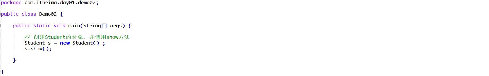
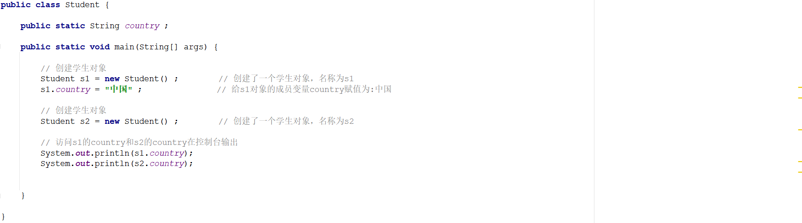
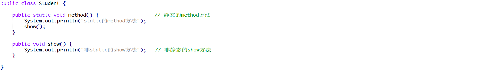
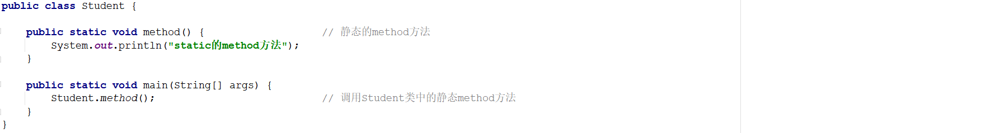

# 1 简答题

## 1.2 简答题一

请分析如下程序编译是否会报错并说明原因？并给出正确的代码！

|  |
| ------------------------------------------------------------ |
|  |

```java
答：
```

## 1.3 简答题二

请分析如下程序在控制台的执行结果并说明原因？

|  |
| ------------------------------------------------------------ |

```java
答：
```

## 1.4 简答题三

请分析如下程序编译是否会报错并说明原因？

|  |
| ------------------------------------------------------------ |

```java
答：
```

## 1.5 简答题四

请分析如下程序编译是否会报错并说明原因？

|  |
| ------------------------------------------------------------ |

```java
答：
```

# 2 编程题

第一题：练习今日的代码

第二题：分析以下需求，并用代码实现
	1.定义Person类
		属性：
			姓名name、性别gender、年龄age、国籍nationality；
		方法：吃饭eat、睡觉sleep，工作work。
	2.根据人类，创建一个学生类Student
		增加属性：
			学校school、学号stuNumber；
		重写工作方法（学生的工作是学习）。	
	3.根据人类，创建一个工人类Worker
		增加属性：
			单位unit、工龄workAge；
		重写工作方法（工人的工作是盖房子）。
	4.根据学生类，创建一个学生干部类 StudentLeader
		增加属性：
			职务job；
		增加方法：开会meeting。
	5.编写测试类分别对上述3类具体人物进行测试。

	6.要求运行结果:
		要求使用全参构造分别写出学生和工人对象还有学生干部对象。调用他们的work方法，和学生干部的开会方法
		输出内容如下：
	
		学生需要学习!
		工人的工作是盖房子!
		学生干部喜欢开会!

第三题：分析以下需求，并用代码实现
	1.定义项目经理类 
		属性：
			姓名 工号 工资 奖金
		行为：
			工作work
	2.定义程序员类
		属性：
			姓名 工号 工资
		行为：
			工作work

	3.要求:向上抽取一个父类,让这两个类都继承这个父类,共有的属性写在父类中，子类重写父类中的方法
	
		编写测试类:完成这两个类的测试

第四题：根据需求完成代码:
	1.定义动物类
		属性：
			年龄，颜色
		行为:
			eat(String something)方法(无具体行为,不同动物吃的方式和东西不一样,something表示吃的东西)
			生成空参有参构造，set和get方法

	2.定义狗类继承动物类	  
		行为:
			eat(String something)方法,看家lookHome方法(无参数)
	
	3.定义猫类继承动物类
		行为:eat(String something)方法,逮老鼠catchMouse方法(无参数)
	
	4.定义Person类
		属性：
			姓名，年龄
		行为：
			keepPet(Dog dog,String something)方法
				功能：喂养宠物狗，something表示喂养的东西
		行为：
			keepPet(Cat cat,String something)方法
				功能：喂养宠物猫，something表示喂养的东西
		生成空参有参构造，set和get方法  
		
	5.测试以上方法


