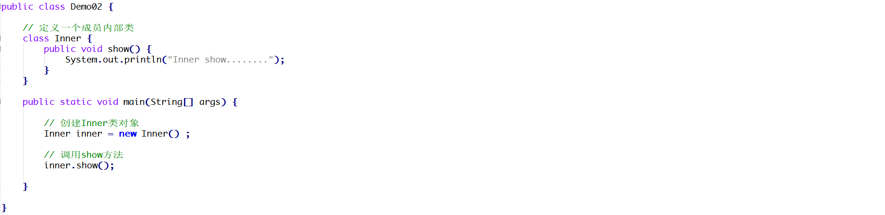

# 1 简答题

## 1.1 简答题一

请分析如下程序是否会报错并说明原因？

|  |
| ------------------------------------------------------------ |

```java
答：报错，因为局部内部类不能使用修饰符修饰。
```

## 1.2 简答题二

请分析如下程序是否会报错并说明原因？并给出正确的代码！

|  |
| ------------------------------------------------------------ |

```java
答：会报错，因为成员内部类不是静态的，在静态的main方法中无法创建对象，调用方法。
    public class Demo02{


    public static void main(String[] args) {
        Inner inner = new Inner();
        inner.show();
    }
    static   class Inner{
        public void show(){
            System.out.println("111");
        }
    }
}
    
```

## 1.3 简答题三

请分析如下程序是否会报错并说明原因？并给出正确的代码！

|  |
| ------------------------------------------------------------ |

```java
答：会报错，Inner时静态成员内部类，在main方法中创建Inner对象的方式错误。
    public class Demo03{


    public static void main(String[] args) {
        Demo01.Inner inner = new Demo01.Inner();
        inner.show();
    }
    static   class Inner{
        public void show(){
            System.out.println("111");
        }
    }
}
```

## 1.4 简答题四

如下程序想在控制台输出30,20,10那么在9,10,11行代码的输出语句中应该填写什么代码？

|  |
| ------------------------------------------------------------ |

```java
答：num
    this.num
    Outer.this.num
```

## 1.5 简答题五

下面lambda表达式的书写是否正确并说明原因？并给出正确的代码！

|  |
| ------------------------------------------------------------ |

```java
答：错误，因为在标明形参时，要不都把类型写上，要不都不要写。
    show((a,b) -> a+b);
```

# 2 编程题

## 2.1 Lambda练习

给定一个导演 Director接口，内含唯一的抽象方法makeMovie，且无参数、无返回值，请使用lambda表达式在Test中补全代码完成调用,打印输出“导演拍电影啦！”字样

```
public interface Director {
	void makeMovie();
}
public class Test{
	public static void main(String[] args) {
		//请使用Lambda和省略格式调用invokeDirect方法,打印输出“导演拍电影啦！”字样
		
 	}

	private static void invokeDirect(Director director) {
  		director.makeMovie();
 	}
}
```


## 2.2 Lambda练习

编写一个计算器Calculator接口，内含抽象方法calc (减法)，其功能是可以将两个数字进行相减，并返回差值;

请在测试类中编写使用接口的方法invokeCalc,并在主方法中分别使用Lambda的标准格式及省略格式调用 invokeCalc 方法，完成130和120的相减计算并输出计算结果;