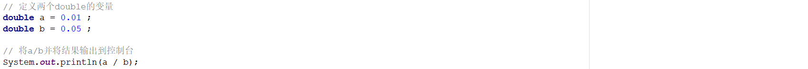

# 1 简答题

## 1.1 简答题一

请分析如下程序是否会报错(编译版本JDK1.8)并说明原因？并给出正确的代码！

|  |
| ------------------------------------------------------------ |

```java
答：
```

## 1.2 简答题二

请分析如下程序是否会报错并说明原因？并给出正确的代码！

|  |
| ------------------------------------------------------------ |

```java
答：
```

## 1.3 简答题三

请分析如下程序是否会报错并说明原因？并给出正确的代码！

|  |
| ------------------------------------------------------------ |

```java
答：
```

## 1.4 简答题四

请分析如下程序那几行代码会报错并说明原因？

|  |
| ------------------------------------------------------------ |

```java
答：
```

## 1.5 简答题五

请分析如下程序是否会报错并说明原因？并给出正确的代码！

|  |
| ------------------------------------------------------------ |

```java
答：
```

## 1.6 简答题六

请分析如下程序是否会报错并说明原因？

|  |
| ------------------------------------------------------------ |

```java
答：
```

## 1.7 简答题七

请分析如下程序在控制台的输出结果是什么并说明原因？

|  |
| ------------------------------------------------------------ |

```java
答：
```

## 1.8 简答题八

请分析如下程序在控制台的输出结果是什么并说明原因？以及如何避免该问题？

|  |
| ------------------------------------------------------------ |

```java
答：
```

## 1.9 简答题九

请分析如下程序执行完毕以后在控制台的输出结果是什么并说明原因？

|  |
| ------------------------------------------------------------ |

```java
答：
```

## 1.10 简答题十

请分析如下程序执行完毕以后在控制台的输出结果是什么并说明原因？

|  |
| ------------------------------------------------------------ |

```java
答：
```

## 1.11 简答题十一

如下程序：

|  |
| ------------------------------------------------------------ |

执行完毕以后在控制台的数据结果为：

|  |
| ------------------------------------------------------------ |

请说明产生该结果的原因，并且给出精确输出(得到结果为0.2)的代码！

```java
答：
```

# 2 编程题

## 编程题【Math类】

请编程进行以下运算：
请计算3的5次幂
请计算3.2向上取整的结果
请计算3.8向下取整的结果
请计算5.6四舍五入取整的结果

**参考答案:**

```java

```

**运行结果:**


## 编程题【System类】

请定义一个集合,并将1至1千万这1千万个数字添加到集合中，计算这个行为运行的时间，并打印。

**参考答案:**

```java

```

**运行结果:**


(注意:每个人的电脑性能不一样,所以打印结果不一样也很正常!!!)

## 编程题【BigDecimal类】

求以下double数组的平均值(四舍五入保留两位小数)：

double[] arr = {0.1,0.2,2.1,3.2,5.56,7.21};

**参考答案:**

```java

```

**运行结果:**

