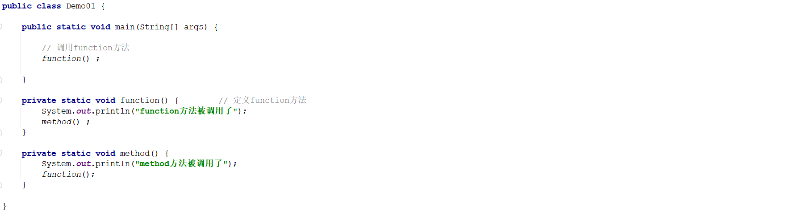
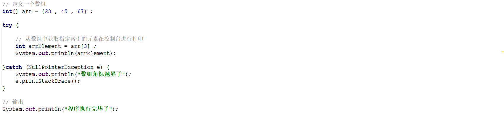
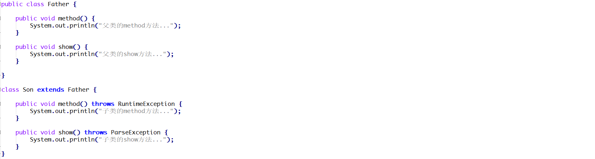
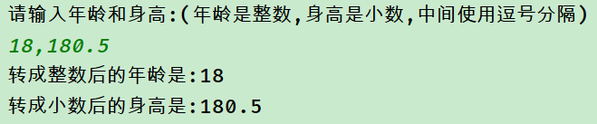
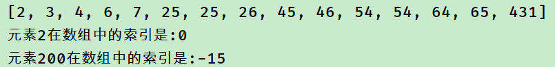
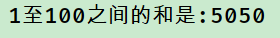

## 1.1 简答题

请分析如下程序执行完毕以后在控制台的最终输出结果是什么并说明原因？

|  |
| ------------------------------------------------------------ |

```java
答：
```

## 1.2 简答题

有数组：[23 , 78, 12 , 45 , 11 , 99]。现需要查找11这个元素在数组中出现的索引，请问是否可以使用二分查找进行实现？如果不能，请说明原因？并且给出你的查找代码。

```java
答：
```

## 1.3 简答题

请分析如下程序执行完毕以后在控制台的输出结果是什么并说明原因？

|  |
| ------------------------------------------------------------ |

```java
答：
```


## 1.4 简答题

简述throw和throws的区别？

```
答：
```

## 1.5 简答题

下述程序编译能否通过？如果不能，请说明哪一个方法会报错并说明原因？

|  |
| ------------------------------------------------------------ |

```java
答：
```


## 问答题【包装类】

### 1 请写出八种基本类型和它们对应的包装类的名字

```java

```


### 2 请问什么是自动装箱和自动拆箱？

```java

```

### 3:编程题【包装类】

在一行中通过键盘输入自己的年龄和身高(要带小数),年龄和身高中间使用逗号分隔,请利用今天的技术和字符串的切分方法,将键盘输入的数据转成整数和小数;

**参考答案:**

```java

```

**运行结果:**



## 编程题【Arrays】

已知数组如下:
int[] arr = {431,54,25,25,26,45,2,4,65,3,64,6,46,7,54};
1:使用Arrays对数组元素进行排序并打印排序后的结果；
2:使用二分法查找元素：2，并打印查询结果；
3:使用二分法查找200，并打印查找结果；

**参考答案:**

```java

```

**运行结果:**



## 编程题【递归】

请使用递归计算从1到100之间的所有数之和。

**参考答案:**

```java

```

**运行结果:**




## 编程题(异常)

### 题目1

按要求补全代码,使main方法能够正常执行到结束;

```java
public static void main(String[] args){
	int[] arr = new int[0];
    //提示:下面这一行代码会导致方法内抛出“空指针异常”,需要你补充一些代码,使让程序继续执行
    int n1 = getMax(null);
    //提示:下面这一行代码会导致方法内抛出“索引越界异常”,需要你补充一些代码,使让程序继续执行
	int n2 = getMax(arr);
	int[] arr2 = {1,2,4,24,32,5324,32};
	int n3 = getMax(arr2);
	System.out.println("程序终于执行完了...");
}
//获取数组最大值
public static int getMax(int[] args){
	int max = args[0];
	for(int i = 1 ; i < args.length ; i++){
		if(max < args[i]){
			max = args[i];
		}
	}
	return max;
}
```

**提示:**

可以利用异常的技术,捕获程序中的异常,然后可以让程序继续执行;

**效果:**


**参考代码:**

```java

```

### 题目2

请从控制台接收两个整数并计算两个数的商,使用程序控制,如果用户输入的不是整数,则提示用户重新输入;

**提示:**

注意:如果我们使用nextInt方法让用户输入整数,但用户实际输入的不是整数的时候,会发生异常,而对于一个键盘输入对象来说,一旦发生异常,即使使用try{}catch(){}语句进行了处理,这个键盘输入对象也无法继续工作了,解决的办法就是重写创建新的键盘输入对象即可;

**效果:**


**参考代码:**

```java

```


### 题目3

自定义一个键盘输入的工具类,提供3个静态方法,分别完成让用户输入整数,小数,和字符串的功能,且当用户输入错误的时候,不能结束程序,要给用户重新输入的机会;

**提示:**

其实就是把上一题中处理异常和键盘输入的代码抽取出来,形成一个独立的工具类即可;

**效果:**


**参考代码:**

```java

```

