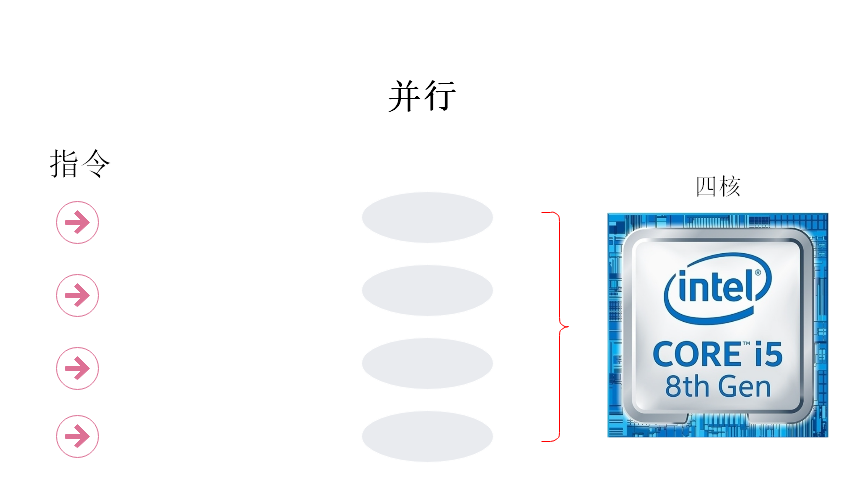
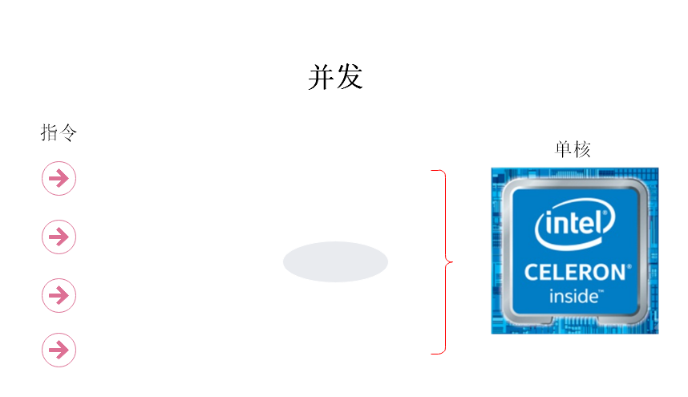
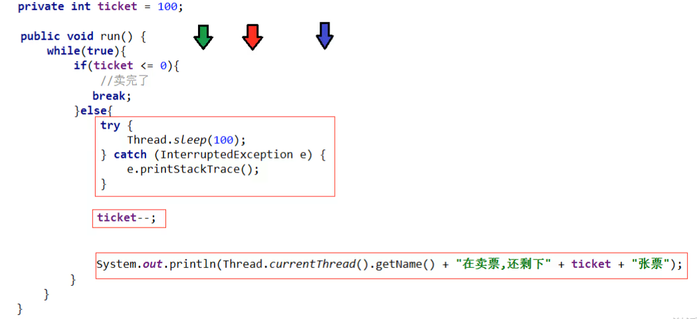
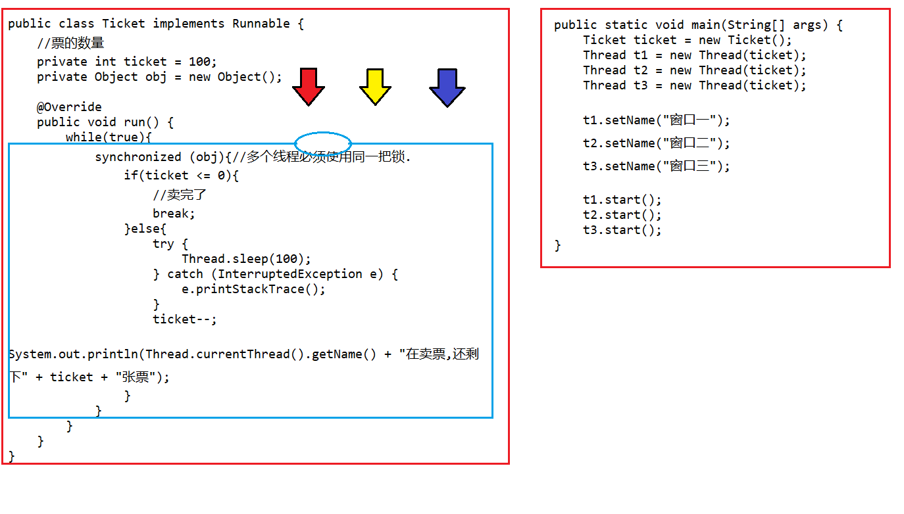
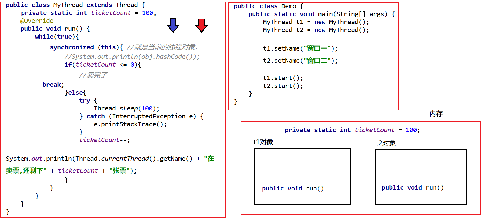
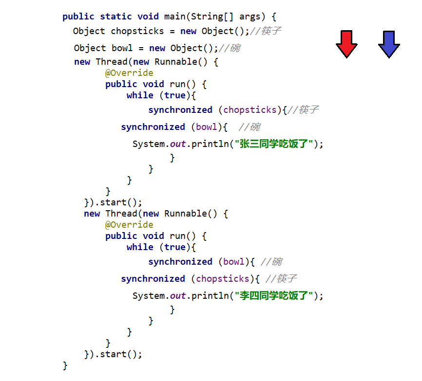
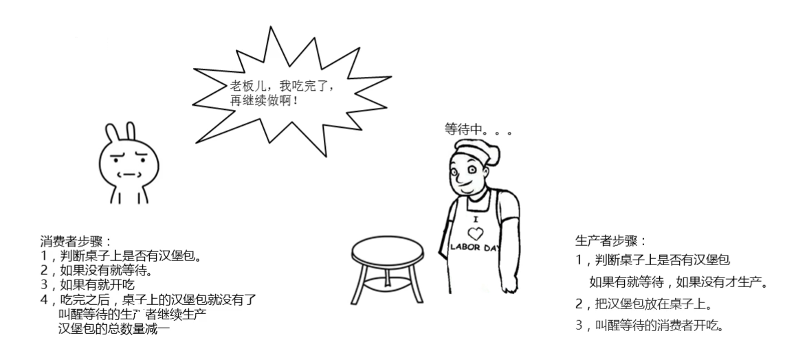

## 知识点

1. 多线程的概念
2. 多线程的实现方式(重点)
3. 线程类的常见方法
4. 线程同步(重点,难点)
5. 死锁
6. 生产者消费者

## 1.多线程的概念

### 1.1初步了解多线程【重点】(视频01 2‘’)

1.什么是多线程？

-   采用多线程技术可以同时执行多个任务(抽烟是一个任务,听音乐是一个任务,打字是一个任务)
-   多线程需要硬件支持


---


**现实生活中这样同时做多件事情的例子很多,看起来好像是多个任务都在做,但是本质上大脑在同一时间只做了一件事.**

### 1.2并发和并行【重点】（视频02 2‘’）

1.什么是并行？

   在同一时刻，有多个指令在多个CPU上**同时**执行



2.什么是并发？

   在一段时间内，有多个指令在单个CPU上**交替**执行



### 1.3进程和线程【重点】(视频03 4‘’)

#### 1.什么是进程？

 可以理解为正在运行的程序,是操作系统分配和调度的最小单元,比如你的TLIAS播放器,IDE,微信等等.

#### 2.什么是线程？

   程序中做的事情, 线程是CPU调度最小单元

#### 3.线程和进程的关系？

   线程它是进程的一部分，不能独立存在

   一个进程，可以有多条线程，至少有一条线程


#### 4.为什么要学习多线程

   可以让程序同时做不同的事情,提高程序的执行效率（例如迅雷同时下载多个文件）

## 2.多线程的实现方式

### 2.1实现多线程方式一：继承Thread类【重点】(视频04 4‘’)

1.实现多线程的方式有哪些？

-    继承Thread类的方式进行实现
-    实现Runnable接口的方式进行实现
-    利用Callable和Future接口方式实现

2.Thread类

   表示线程的类

3.方法介绍

| 方法名          | 说明                             |
| ------------ | ------------------------------ |
| void run()   | 在线程开启后，此方法将被调用执行               |
| void start() | 使此线程开始执行，Java虚拟机会调用此线程的run方法() |

4.实现步骤

- 定义一个类MyThread继承Thread类
- 在MyThread类中重写run()方法
- 创建MyThread类的对象
- 启动线程

代码演示

```java
package com.itheima.threaddemo1;
public class MyThread extends Thread{
    @Override
    public void run() {
        //代码就是线程在开启之后执行的代码
        for (int i = 0; i < 100; i++) {
            System.out.println("线程开启了" + i);
        }
    }
}

package com.itheima.threaddemo1;

public class Demo {
    public static void main(String[] args) {
        //创建一个线程对象
        MyThread t1 = new MyThread();
        //创建一个线程对象
        MyThread t2 = new MyThread();
        //开启一条线程
        t1.start();
        //开启第二条线程
        t2.start();
    }
}
```

6.线程执行的特点

运行的结果每次有可能不一样，表示有随机性,**为什么呢？因为线程的执行是由CPU来执行的，CPU说得算**


### 2.2 多线程的实现方式-两个小问题【了解】(视频05 3'')

1.为什么要重写run()方法？

​	因为run()是用来封装被线程执行的代码

2.run()方法和start()方法的区别？

​	run()：封装线程执行的代码，直接调用，相当于普通方法的调用

​	start()：启动线程；然后由JVM调用此线程的run()方法

### 2.3实现多线程方式二：实现Runnable接口【重点】(视频06 5‘’)

####  1.Thread构造方法

| 方法名                     | 说明             |
| ----------------------- | -------------- |
| Thread(Runnable target) | 分配一个新的Thread对象 |

#### 2.实现步骤

- 定义一个类MyRunnable实现Runnable接口
- 在MyRunnable类中重写run()方法
- 创建MyRunnable类的对象
- 创建Thread类的对象，把MyRunnable对象作为构造方法的参数
- 启动线程


代码演示

```java
package com.itheima.threaddemo2;

public class MyRunnable implements Runnable{
    @Override
    public void run() {
        //线程启动后执行的代码
        for (int i = 0; i < 100; i++) {
            System.out.println("第二种方式实现多线程" + i);
        }
    }
}

package com.itheima.threaddemo2;

public class Demo {
    public static void main(String[] args) {
        //创建了一个参数的对象
        MyRunnable mr = new MyRunnable();
        //创建了一个线程对象,并把参数传递给这个线程.
        //在线程启动之后,执行的就是参数里面的run方法
        Thread t1 = new Thread(mr);
        //开启线程
        t1.start();


        MyRunnable mr2 = new MyRunnable();
        Thread t2 = new Thread(mr2);
        t2.start();

    }
}
```


### 2.4 实现多线程方式三: 实现Callable接口【重点】(视频07 10‘’)

#### 1.方法介绍

| 方法名                              | 说明                                  |
| -------------------------------- | ----------------------------------- |
| V call()                         | 计算结果，如果无法计算结果，则抛出一个异常               |
| FutureTask(Callable<V> callable) | 创建一个 FutureTask，一旦运行就执行给定的 Callable |
| V get()                          | 如有必要，等待计算完成，然后获取其结果                 |

#### 2.实现步骤

+ 定义一个类MyCallable实现Callable接口
+ 在MyCallable类中重写call()方法
+ 创建MyCallable类的对象
+ 创建Future的实现类FutureTask对象，把MyCallable对象作为构造方法的参数
+ 创建Thread类的对象，把FutureTask对象作为构造方法的参数
+ 启动线程
+ 再调用get方法，就可以获取线程结束之后的结果。

#### 3.注意事项

 get()方法的调用一定要在Thread类对象调用start()方法之后


代码演示

```java
package com.itheima.threaddemo3;

import java.util.concurrent.Callable;

public class MyCallable implements Callable<String> {
    @Override
    public String call() throws Exception {
        for (int i = 0; i < 100; i++) {
            System.out.println("跟女孩表白" + i);
        }
        //返回值就表示线程运行完毕之后的结果
        return "答应";
    }
}

package com.itheima.threaddemo3;

import java.util.concurrent.ExecutionException;
import java.util.concurrent.FutureTask;

public class Demo {
    public static void main(String[] args) throws ExecutionException, InterruptedException {
        //线程开启之后需要执行里面的call方法
        MyCallable mc = new MyCallable();

        //Thread t1 = new Thread(mc);

        //可以获取线程执行完毕之后的结果.也可以作为参数传递给Thread对象
        FutureTask<String> ft = new FutureTask<>(mc);

        //创建线程对象
        Thread t1 = new Thread(ft);

        //String s = ft.get();
        //开启线程
        t1.start();

        String s = ft.get();//返回值是callable接口的，所以用ft调用
        System.out.println(s);
    }
}
```

### 2.5 三种实现方式的对比【重点】【视频08 4''】

#### 1.实现Runnable、Callable接口

+ 好处: 扩展性强，实现该接口的同时还可以继承其他的类
+ 缺点: 编程相对复杂，不能直接使用Thread类中的方法

#### 2.继承Thread类

+ 好处: 编程比较简单，可以直接使用Thread类中的方法
+ 缺点: 扩展性较差，不能再继承其他的类

#### 3.实际开发过程中如何选择?

如果不需要任务的返回结果，就实现Runnable接口，需要的话，实现Callable接口

#### 4.如何去写多线程程序

1.确定要做什么，执行什么任务

2.要不要用多线程，要任务返回的结果，如果要实现Callable接口，如果不要实现Runnable接口

3.实现call方法或run方法

4.交给线程类，执行start()，开启线程干活

## 3.线程类中的常见方法

### 3.1设置和获取线程名称【重点】(视频9 8‘’)

方法介绍

| 方法名                           | 说明                 |
| ----------------------------- | ------------------ |
| void     setName(String name) | 将此线程的名称更改为等于参数name |
| String  getName()             | 返回此线程的名称           |

代码演示

```java
package com.itheima.threaddemo4;

public class MyThread extends Thread {

    public MyThread() {
  	}
	
    public MyThread(String name) {
        super(name);
    }

    @Override
    public void run() {
        for (int i = 0; i < 100; i++) {
            System.out.println(getName() + "@@@" + i);
        }
    }
}

package com.itheima.threaddemo4;

public class Demo {
    //1,线程是有默认名字的,格式:Thread-编号
    public static void main(String[] args) {
        MyThread t1 = new MyThread("小蔡");
        MyThread t2 = new MyThread("小强");

        //t1.setName("小蔡");
        //t2.setName("小强");

        t1.start();
        t2.start();
    }
}
```

### 3.2 Tread方法-获得当前线程对象【重点】(视频10 3'')

| 方法名                            | 说明                |
| ------------------------------ | ----------------- |
| static Thread  currentThread() | 返回对当前正在执行的线程对象的引用 |

```java
package com.itheima.threaddemo5;
public class Demo {
    public static void main(String[] args) {
        String name = Thread.currentThread().getName();
        System.out.println(name);
    }
}
```

### 3.3 线程休眠【重点】(视频11 5‘’)

1.相关方法

| 方法名                            | 说明                       |
| ------------------------------ | ------------------------ |
| static void sleep(long millis) | 使当前正在执行的线程停留（暂停执行）指定的毫秒数 |

代码演示

```java
package com.itheima.threaddemo6;

public class MyRunnable implements Runnable {
    @Override
    public void run() {
        for (int i = 0; i < 100; i++) {
            try {
                Thread.sleep(100);
            } catch (InterruptedException e) {
                e.printStackTrace();
            }

            System.out.println(Thread.currentThread().getName() + "---" + i);
        }
    }
}
```

```java
package com.itheima.threaddemo6;

public class Demo {
    public static void main(String[] args) throws InterruptedException {
        /*System.out.println("睡觉前");
        Thread.sleep(3000);
        System.out.println("睡醒了");*/

        MyRunnable mr = new MyRunnable();

        Thread t1 = new Thread(mr);
        Thread t2 = new Thread(mr);

        t1.start();
        t2.start();
    }
}
```

### 3.4 线程优先级【了解】(视频12 10'')

1.优先级相关方法

| 方法名                                     | 说明                                |
| --------------------------------------- | --------------------------------- |
| final int getPriority()                 | 返回此线程的优先级                         |
| final void setPriority(int newPriority) | 更改此线程的优先级线程默认优先级是5；线程优先级的范围是：1-10 |

代码演示

```java
package com.itheima.threaddemo7;

import java.util.concurrent.Callable;

public class MyCallable implements Callable<String> {
    @Override
    public String call() throws Exception {
        for (int i = 0; i < 100; i++) {
            System.out.println(Thread.currentThread().getName() + "---" + i);
        }
        return "线程执行完毕了";
    }
}
```

```java
package com.itheima.threaddemo7;

import java.util.concurrent.FutureTask;

public class Demo {
    public static void main(String[] args) {
        //优先级: 1 - 10 默认值:5
        MyCallable mc = new MyCallable();

        FutureTask<String> ft = new FutureTask<>(mc);

        Thread t1 = new Thread(ft);
        t1.setName("飞机");
        t1.setPriority(10);
        //System.out.println(t1.getPriority());//5
        t1.start();

        MyCallable mc2 = new MyCallable();

        FutureTask<String> ft2 = new FutureTask<>(mc2);

        Thread t2 = new Thread(ft2);
        t2.setName("坦克");
        t2.setPriority(1);
        //System.out.println(t2.getPriority());//5
        t2.start();
    }
}
```


### 3.5 守护线程【了解】(视频13 6‘’)

1.什么是守护线程？

   守护其它线程，当普通线程执行完毕了，守护线程就没有存在的必要了

2.如何使用守护线程？

相关方法

| 方法名                        | 说明                                   |
| -------------------------- | ------------------------------------ |
| void setDaemon(boolean on) | 将此线程标记为守护线程，当运行的线程都是守护线程时，Java虚拟机将退出 |

代码演示

```java
package com.itheima.threaddemo8.example;


public class MyThread1 extends Thread{

    @Override
    public void run() {
        for (int i = 0; i < 10; i++) {
            System.out.println(this.getName()+"---"+i);
        }
    }
}
```

```java
package com.itheima.threaddemo8.example;


public class MyThread2 extends Thread{

    @Override
    public void run() {
        for (int i = 0; i < 100; i++) {
            System.out.println(this.getName()+"---"+i);
        }
    }
}
```

```java
package com.itheima.threaddemo8.example;


public class Test {

    public static void main(String[] args) {
        MyThread1 t1 = new MyThread1();//主人 
        MyThread2 t2 = new MyThread2();//保镖
        t2.setDaemon(true);
       	t1.setName("主人");
       	t2.setName("保镖");
       	t2.start();
      	t1.start();
    }
}
```

## 4.线程同步

### 4.1卖票【难点】（视频14 7‘’）

- 案例需求

  某电影院目前正在上映国产大片，共有100张票，而它有3个窗口卖票，请设计一个程序模拟该电影院卖票

- 实现步骤

  - 定义一个类SellTicket实现Runnable接口，里面定义一个成员变量：private int tickets = 100;

  - 在SellTicket类中重写run()方法实现卖票，代码步骤如下

  - 判断票数大于0，就卖票，并告知是哪个窗口卖的
  - 卖了票之后，总票数要减1
  - 票卖没了，线程停止
  - 定义一个测试类SellTicketDemo，里面有main方法，代码步骤如下
  - 创建SellTicket类的对象
  - 创建三个Thread类的对象，把SellTicket对象作为构造方法的参数，并给出对应的窗口名称
  - 启动线程

- 代码实现

  ```java
  package com.itheima.threaddemo9;

  public class Ticket implements Runnable {
      //票的数量
      private int ticket = 100;

      @Override
      public void run() {
          while(true){
              
                  if(ticket == 0){
                      //卖完了
                      break;
                  }else{
                      ticket--;
                      System.out.println(Thread.currentThread().getName() + "在卖票,还剩下" + ticket + "张票");
                  }
              }
          
    }
  }

  package com.itheima.threaddemo9;

  public class Demo {
      public static void main(String[] args) {
          Ticket ticket = new Ticket();

          Thread t1 = new Thread(ticket);
          Thread t2 = new Thread(ticket);
          Thread t3 = new Thread(ticket);

          t1.setName("窗口一");
          t2.setName("窗口二");
          t3.setName("窗口三");

          t1.start();
          t2.start();
          t3.start();
      }
  }
  ```

### 4.2 线程安全问题-原因分析【难点】(视频15 10‘’)

1、什么是线程安全问题?

​      所谓的线程安全问题就是多线程环境下，出现数据结果与预期不一致的情况就称为线程安全问题

2.卖票出现了问题



3.出现重复票和负号票的原因

  卖票的过程中有多条线程操作了共享数据

### 4.3同步代码块解决数据安全问题【重点】(视频16 9‘’)

#### 1.如何解决上述问题呢？

- 任意时刻只有一条线程可以**操作（增、删、改、查）**共享变量

- Java中如何解决？

同步代码块格式：

```java
synchronized(任意对象) { 
	操作共享数据的代码 
}
```

synchronized(任意对象)：就相当于给代码加锁了，任意对象就可以看成是一把锁

#### 2.synchronized同步代码块的特点？

   默认情况下是打开的，只要有一个线程进去执行代码了，锁就会关闭

   当线程执行完出来时，锁才会自动打开

#### 3.什么情况下会出现线程安全问题呢？

​	多条线程操作共享数据（可以拆分为三个条件）:

​	1.多线程环境

​	2.有共享数据

​	3.多条线程操作了共享数据

==因此，在卖票的时候，加不加Thread.sleep()代码中都会有线程安全问题，只不过加上之后，线程执行的速度慢了下来，我们可以观察到问题==

代码演示

```java
package com.itheima.threaddemo9;
public class Ticket implements Runnable {
    //票的数量
    private int ticket = 100;
    private Object obj = new Object();

    @Override
    public void run() {
        while(true){
            synchronized (obj){//多个线程必须使用同一把锁.
                if(ticket <= 0){
                    //卖完了
                    break;
                }else{
                    try {
                        Thread.sleep(100);
                    } catch (InterruptedException e) {
                        e.printStackTrace();
                    }
                    ticket--;
                    System.out.println(Thread.currentThread().getName() + "在卖票,还剩下" + ticket + "张票");
                }
            }
        }
    }
}

package com.itheima.threaddemo9;

public class Demo {
    public static void main(String[] args) {
        Ticket ticket = new Ticket();
        Thread t1 = new Thread(ticket);
        Thread t2 = new Thread(ticket);
        Thread t3 = new Thread(ticket);

        t1.setName("窗口一");
        t2.setName("窗口二");
        t3.setName("窗口三");

        t1.start();
        t2.start();
        t3.start();
    }
}
```

### 4.4 线程安全问题-锁对象唯一【重点】 (视频17 7‘’)

#### 1.锁对象为什么要唯一？

   不同线程如果锁的不是同一个对象，就解决不了线程的安全问题



​																		this为什么解决不了线程安全问题

```java
package com.itheima.threaddemo10;

public class MyThread extends Thread {
    private static int ticketCount = 100;
    private static Object obj = new Object();

    @Override
    public void run() {
        while(true){
            synchronized (obj){ //就是当前的线程对象.
                if(ticketCount <= 0){
                    //卖完了
                    break;
                }else{
                    try {
                        Thread.sleep(100);
                    } catch (InterruptedException e) {
                        e.printStackTrace();
                    }
                    ticketCount--;
                    System.out.println(Thread.currentThread().getName() + "在卖票,还剩下" + ticketCount + "张票");
                }
            }
        }
    }
}

package com.itheima.threaddemo010;

public class Demo {
    public static void main(String[] args) {
        MyThread t1 = new MyThread();
        MyThread t2 = new MyThread();

        t1.setName("窗口一");
        t2.setName("窗口二");

        t1.start();
        t2.start();
    }
}
```

### 4.5同步方法解决数据安全问题（视频18 10‘’）

1.同步方法的格式

同步方法：就是把synchronized关键字加到方法上

```java
修饰符 synchronized 返回值类型 方法名(方法参数) { 
	方法体；
}
```

同步代码块和同步方法的区别:

同步代码块可以锁住指定的代码,当时同步方法锁住的是整个方法里面的代码

同步代码块可以指定锁对象,但是同步方法不能指定锁对象


#### 2.同步方法的锁对象是什么呢?【重点】

​	this

```java
public class MyRunnableCommon implements Runnable {
    private static int ticketCount = 100;
    @Override
    public void run() {
        while(true){
            if("窗口一".equals(Thread.currentThread().getName())){
                //同步方法
                boolean result = synchronizedMthod();
                if(result){
                    break;
                }
            }

            if("窗口二".equals(Thread.currentThread().getName())){
                //同步代码块
                synchronized (this){
                    if(ticketCount == 0){
                       break;
                    }else{
                        try {
                            Thread.sleep(10);
                        } catch (InterruptedException e) {
                            e.printStackTrace();
                        }
                        ticketCount--;
                        System.out.println(Thread.currentThread().getName() + "在卖票,还剩下" + ticketCount + "张票");
                    }
                }
            }

        }
    }

    private  synchronized boolean synchronizedMthod() {
        if(ticketCount == 0){
            return true;
        }else{
            try {
                Thread.sleep(10);
            } catch (InterruptedException e) {
                e.printStackTrace();
            }
            ticketCount--;
            System.out.println(Thread.currentThread().getName() + "在卖票,还剩下" + ticketCount + "张票");
            return false;
        }
    }
}
```

3.静态同步方法的格式

​	同步静态方法：就是把synchronized关键字加到静态方法上

```java
修饰符 static synchronized 返回值类型 方法名(方法参数) { 
	方法体；
}
```

#### 4.同步静态方法的锁对象是什么呢【重点】?

​	类名.class

代码演示

```java
package com.itheima.threaddemo011;

public class MyRunnable implements Runnable {
    private static int ticketCount = 100;

    @Override
    public void run() {
        while(true){
            if("窗口一".equals(Thread.currentThread().getName())){
                //同步方法
                boolean result = synchronizedMthod();
                if(result){
                    break;
                }
            }

            if("窗口二".equals(Thread.currentThread().getName())){
                //同步代码块
                synchronized (MyRunnable.class){
                    if(ticketCount == 0){
                       break;
                    }else{
                        try {
                            Thread.sleep(10);
                        } catch (InterruptedException e) {
                            e.printStackTrace();
                        }
                        ticketCount--;
                        System.out.println(Thread.currentThread().getName() + "在卖票,还剩下" + ticketCount + "张票");
                    }
                }
            }

        }
    }

    private static synchronized boolean synchronizedMthod() {
        if(ticketCount == 0){
            return true;
        }else{
            try {
                Thread.sleep(10);
            } catch (InterruptedException e) {
                e.printStackTrace();
            }
            ticketCount--;
            System.out.println(Thread.currentThread().getName() + "在卖票,还剩下" + ticketCount + "张票");
            return false;
        }
    }
}


package com.itheima.threaddemo011;

public class Demo {
    public static void main(String[] args) {
        MyRunnable mr = new MyRunnable();

        Thread t1 = new Thread(mr);
        Thread t2 = new Thread(mr);

        t1.setName("窗口一");
        t2.setName("窗口二");

        t1.start();
        t2.start();
    }
}
```

### 4.6 Lock锁【重点】（视频19 5‘’）

1.如何手动开关锁呢？

   使用lock

2.如何使用Lock？

​	Lock是接口不能直接实例化，这里采用它的实现类ReentrantLock来实例化

​	ReentrantLock构造方法

| 方法名             | 说明                   |
| --------------- | -------------------- |
| ReentrantLock() | 创建一个ReentrantLock的实例 |

​	加锁解锁方法

| 方法名           | 说明   |
| ------------- | ---- |
| void lock()   | 获得锁  |
| void unlock() | 释放锁  |

代码演示

```java
package com.itheima.threaddemo012;

import java.util.concurrent.locks.ReentrantLock;

public class Ticket implements Runnable {
    //票的数量
    private int ticket = 100;
    private Object obj = new Object();
    private ReentrantLock lock = new ReentrantLock();

    @Override
    public void run() {
        while (true) {
            //synchronized (obj){//多个线程必须使用同一把锁.
            try {
                lock.lock();
                if (ticket <= 0) {
                    //卖完了
                    break;
                } else {
                    Thread.sleep(100);
                    ticket--;
                    System.out.println(Thread.currentThread().getName() + "在卖票,还剩下" + ticket + "张票");
                }
            } catch (InterruptedException e) {
                e.printStackTrace();
            } finally {
                lock.unlock();
            }
            // }
        }
    }
}

package com.itheima.threaddemo012;

public class Demo {
    public static void main(String[] args) {
        /*Ticket ticket1 = new Ticket();
        Ticket ticket2 = new Ticket();
        Ticket ticket3 = new Ticket();

        Thread t1 = new Thread(ticket1);
        Thread t2 = new Thread(ticket2);
        Thread t3 = new Thread(ticket3);*/

        Ticket ticket = new Ticket();

        Thread t1 = new Thread(ticket);
        Thread t2 = new Thread(ticket);
        Thread t3 = new Thread(ticket);

        t1.setName("窗口一");
        t2.setName("窗口二");
        t3.setName("窗口三");

        t1.start();
        t2.start();
        t3.start();
    }
}
```

### 4.7 死锁【了解】(视频20 7‘’)

1.什么是死锁?

线程死锁是指由于两个或者多个线程互相持有对方所需要的资源，导致这些线程处于等待状态，无法前往执行


​																							吃饭

代码演示



## 5.生产者消费者 (MQ)

### 5.1 生产者和消费者思路分析【了解】（视频21 8‘’）



### 5.2生产者和消费者案例【了解】（视频22 14‘’）

Object类的等待和唤醒方法

| 方法名                  | 说明                                       |
| -------------------- | ---------------------------------------- |
| **void wait()**      | **导致当前线程等待同时释放锁，直到另一个线程调用该对象的 notify()方法或 notifyAll()方法** |
| **void notify()**    | **唤醒正在等待单个线程,并不立即释放锁**                   |
| **void notifyAll()** | **唤醒正在等待所有线程,并不立即释放锁**                   |
- 案例需求

  + 桌子类(Desk)：定义表示包子数量的变量,定义锁对象变量,定义标记桌子上有无包子的变量

  + 生产者类(Cooker)：实现Runnable接口，重写run()方法，设置线程任务

    1.判断是否有包子,决定当前线程是否执行

    2.如果有包子,就进入等待状态,如果没有包子,继续执行,生产包子

    3.生产包子之后,更新桌子上包子状态,唤醒消费者消费包子

  + 消费者类(Foodie)：实现Runnable接口，重写run()方法，设置线程任务

    1.判断是否有包子,决定当前线程是否执行

    2.如果没有包子,就进入等待状态,如果有包子,就消费包子

    3.消费包子后,更新桌子上包子状态,唤醒生产者生产包子

  + 测试类(Demo)：里面有main方法，main方法中的代码步骤如下

    创建生产者线程和消费者线程对象

    分别开启两个线程

- 代码实现

  ```java
  public class Desk {

      //定义一个标记
      //true 就表示桌子上有汉堡包的,此时允许吃货执行
      //false 就表示桌子上没有汉堡包的,此时允许厨师执行
      public static boolean flag = false;

      //汉堡包的总数量
      public static int count = 10;

      //锁对象
      public static final Object lock = new Object();
  }

  public class Cooker extends Thread {
  //    生产者步骤：
  //            1，判断桌子上是否有汉堡包
  //    如果有就等待，如果没有才生产。
  //            2，把汉堡包放在桌子上。
  //            3，叫醒等待的消费者开吃。
      @Override
      public void run() {
          while(true){
              synchronized (Desk.lock){
                  if(Desk.count == 0){
                      break;
                  }else{
                      if(!Desk.flag){
                          //生产
                          System.out.println("厨师正在生产汉堡包");
                          Desk.flag = true;
                          Desk.lock.notifyAll();
                      }else{
                          try {
                              Desk.lock.wait();
                          } catch (InterruptedException e) {
                              e.printStackTrace();
                          }
                      }
                  }
              }
          }
      }
  }

  public class Foodie extends Thread {
      @Override
      public void run() {
  //        1，判断桌子上是否有汉堡包。
  //        2，如果没有就等待。
  //        3，如果有就开吃
  //        4，吃完之后，桌子上的汉堡包就没有了
  //                叫醒等待的生产者继续生产
  //        汉堡包的总数量减一

          //套路:
              //1. while(true)死循环
              //2. synchronized 锁,锁对象要唯一
              //3. 判断,共享数据是否结束. 结束
              //4. 判断,共享数据是否结束. 没有结束
          while(true){
              synchronized (Desk.lock){
                  if(Desk.count == 0){
                      break;
                  }else{
                      if(Desk.flag){
                          //有
                          System.out.println("吃货在吃汉堡包");
                          Desk.flag = false;
                          Desk.lock.notifyAll();
                          Desk.count--;
                      }else{
                          //没有就等待
                          //使用什么对象当做锁,那么就必须用这个对象去调用等待和唤醒的方法.
                          try {
                              Desk.lock.wait();
                          } catch (InterruptedException e) {
                              e.printStackTrace();
                          }
                      }
                  }
              }
          }

      }
  }

  public class Demo {
      public static void main(String[] args) {
          /*消费者步骤：
          1，判断桌子上是否有汉堡包。
          2，如果没有就等待。
          3，如果有就开吃
          4，吃完之后，桌子上的汉堡包就没有了
                  叫醒等待的生产者继续生产
          汉堡包的总数量减一*/

          /*生产者步骤：
          1，判断桌子上是否有汉堡包
          如果有就等待，如果没有才生产。
          2，把汉堡包放在桌子上。
          3，叫醒等待的消费者开吃。*/

          Foodie f = new Foodie();
          Cooker c = new Cooker();

          f.start();
          c.start();

      }
  }
  ```


