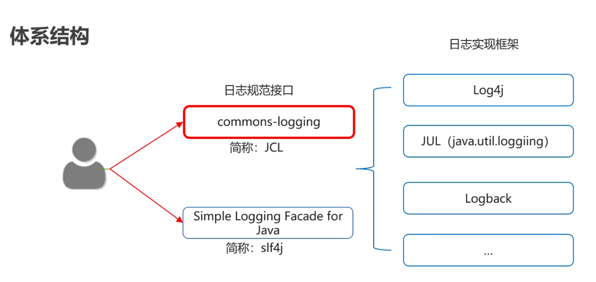

## 1.TCP通信程序

### 1.1TCP发送数据【应用】

- Java中的TCP通信

  - Java对基于TCP协议的的网络提供了良好的封装，使用Socket(地址,套接字)对象来代表两端的通信端口，并通过Socket产生IO流来进行网络通信。
  - Java为客户端(输出,写)提供了Socket类，为服务器(输入读)端提供了ServerSocket类

- 构造方法

  | 方法名                                  | 说明                      |
  | ------------------------------------ | ----------------------- |
  | Socket(InetAddress address,int port) | 创建流套接字并将其连接到指定IP指定端口号   |
  | Socket(String host, int port)        | 创建流套接字并将其连接到指定主机上的指定端口号 |

- 相关方法

  | 方法名                            | 说明         |
  | ------------------------------ | ---------- |
  | InputStream  getInputStream()  | 返回此套接字的输入流 |
  | OutputStream getOutputStream() | 返回此套接字的输出流 |

- 示例代码

  ```java
  public class ClientDemo {
      public static void main(String[] args) throws IOException {
          //创建客户端的Socket对象(Socket)
          //Socket(String host, int port) 创建流套接字并将其连接到指定主机上的指定端口号
          Socket s = new Socket("127.0.0.1",10000);

          //获取输出流，写数据
          //OutputStream getOutputStream() 返回此套接字的输出流
          OutputStream os = s.getOutputStream();
          os.write("hello,tcp,我来了".getBytes());

          //释放资源
          s.close();
      }
  }
  ```

### 1.2TCP接收数据【应用】

- 构造方法

  | 方法名                    | 说明               |
  | ---------------------- | ---------------- |
  | ServerSocket(int port) | 创建绑定到指定端口的服务器套接字 |

- 相关方法

  | 方法名             | 说明              |
  | --------------- | --------------- |
  | Socket accept() | 监听要连接到此的套接字并接受它 |

- 注意事项

  1. accept方法是阻塞的,作用就是等待客户端连接
  2. 客户端创建对象并连接服务器,此时是通过三次握手协议,保证跟服务器之间的连接
  3. 针对客户端来讲,是往外写的,所以是输出流
     针对服务器来讲,是往里读的,所以是输入流
  4. read方法也是阻塞的
  5. 客户端在关流的时候,还多了一个往服务器写结束标记的动作
  6. 最后一步断开连接,通过四次挥手协议保证连接终止

- 三次握手和四次挥手

  - 三次握手

    

  - 四次挥手

    


- 示例代码

  ```java
  public class ServerDemo {
      public static void main(String[] args) throws IOException {
          //创建服务器端的Socket对象(ServerSocket)
          //ServerSocket(int port) 创建绑定到指定端口的服务器套接字
          ServerSocket ss = new ServerSocket(10000);

          //Socket accept() 侦听要连接到此套接字并接受它
          Socket s = ss.accept();

          //获取输入流，读数据，并把数据显示在控制台
          InputStream is = s.getInputStream();
          byte[] bys = new byte[1024];
          int len = is.read(bys);
          String data = new String(bys,0,len);
          System.out.println("数据是：" + data);

          //释放资源
          s.close();
          ss.close();
      }
  }
  ```

### 1.3TCP程序练习【应用】

- 案例需求

  客户端：发送数据，接受服务器反馈

  服务器：收到消息后给出反馈

- 案例分析
  - 客户端创建对象，使用输出流输出数据
  - 服务端创建对象，使用输入流接受数据
  - 服务端使用输出流给出反馈数据
  - 客户端使用输入流接受反馈数据

- 代码实现

  ```java
  // 客户端
  public class ClientDemo {
      public static void main(String[] args) throws IOException {
          Socket socket = new Socket("127.0.0.1",10000);

          OutputStream os = socket.getOutputStream();
          os.write("hello".getBytes());
         // os.close();如果在这里关流,会导致整个socket都无法使用
          socket.shutdownOutput();//仅仅关闭输出流.并写一个结束标记,对socket没有任何影响
          
          BufferedReader br = new BufferedReader(new InputStreamReader(socket.getInputStream()));
          String line;
          while((line = br.readLine())!=null){
              System.out.println(line);
          }
          br.close();
          os.close();
          socket.close();
      }
  }
  // 服务器
  public class ServerDemo {
      public static void main(String[] args) throws IOException {
          ServerSocket ss = new ServerSocket(10000);

          Socket accept = ss.accept();

          InputStream is = accept.getInputStream();
          int b;
          while((b = is.read())!=-1){
              System.out.println((char) b);
          }

          System.out.println("看看我执行了吗?");
  	//accept.getOutputStream()是一个字节输出流
          //new OutputStreamWriter()是把字节流转换成了字符流
          //new BufferedWriter()是字符缓冲输出流对象
          BufferedWriter bw = new BufferedWriter(new OutputStreamWriter(accept.getOutputStream()));
          bw.write("你谁啊?");
        bw.newLine();
          bw.flush();

          bw.close();
          is.close();
          accept.close();
          ss.close();
      }
  }
  ```

### 1.4TCP程序文件上传练习【应用】

- 案例需求

  客户端：数据来自于a本地文件，接收服务器反馈

  服务器：接收到的数据写入b本地文件，给出反馈

- 案例分析
  - 创建客户端对象，创建输入流对象指向文件，每读一次数据就给服务器输出一次数据，输出结束后使用shutdownOutput()方法告知服务端传输结束
  - 创建服务器对象，创建输出流对象指向文件，每接受一次数据就使用输出流输出到文件中，传输结束后。使用输出流给客户端反馈信息
  - 客户端接受服务端的回馈信息

- 相关方法

  | 方法名                   | 说明                 |
  | --------------------- | ------------------ |
  | void shutdownInput()  | 将此套接字的输入流放置在“流的末尾” |
  | void shutdownOutput() | 禁止用此套接字的输出流        |

- 代码实现

  ```java
  // 客户端
  public class ClientDemo {
      public static void main(String[] args) throws IOException {
          Socket socket = new Socket("127.0.0.1",10000);

          //是本地的流,用来读取本地文件的.
          BufferedInputStream bis = new BufferedInputStream(new FileInputStream("socketmodule\\ClientDir\\1.jpg"));

          //写到服务器 --- 网络中的流
          OutputStream os = socket.getOutputStream();
          BufferedOutputStream bos = new BufferedOutputStream(os);

          int b;
          while((b = bis.read())!=-1){
              bos.write(b);//通过网络写到服务器中
          }
          bos.flush();
          //给服务器一个结束标记,告诉服务器文件已经传输完毕
          socket.shutdownOutput();

          BufferedReader br = new BufferedReader(new InputStreamReader(socket.getInputStream()));
          String line;
          while((line = br.readLine()) !=null){
              System.out.println(line);
          }
          bis.close();
          socket.close();
      }
  }
  // 服务器
  public class ServerDemo {
      public static void main(String[] args) throws IOException {
          ServerSocket ss = new ServerSocket(10000);

          Socket accept = ss.accept();

          //网络中的流,从客户端读取数据的
          BufferedInputStream bis = new BufferedInputStream(accept.getInputStream());
          //本地的IO流,把数据写到本地中,实现永久化存储
          BufferedOutputStream bos = new BufferedOutputStream(new FileOutputStream("socketmodule\\ServerDir\\copy.jpg"));

          int b;
          while((b = bis.read()) !=-1){
              bos.write(b);
          }
  	bos.flush();
          BufferedWriter bw = new BufferedWriter(new OutputStreamWriter(accept.getOutputStream()));
          bw.write("上传成功");
          bw.newLine();
          bw.flush();

          bos.close();
          accept.close();
          ss.close();
      }
  }
  ```

### 1.5TCP程序服务器优化【应用】

- 优化方案一

  + 需求

    服务器只能处理一个客户端请求，接收完一个图片之后，服务器就关闭了。

  + 解决方案

    使用循环

  + 代码实现

    ```java
    // 服务器代码如下,客户端代码同上个案例,此处不再给出
    public class ServerDemo {
        public static void main(String[] args) throws IOException {
            ServerSocket ss = new ServerSocket(10000);

            while (true) {
                Socket accept = ss.accept();

                //网络中的流,从客户端读取数据的
                BufferedInputStream bis = new BufferedInputStream(accept.getInputStream());
                //本地的IO流,把数据写到本地中,实现永久化存储
                BufferedOutputStream bos = new BufferedOutputStream(new FileOutputStream("optimizeserver\\ServerDir\\copy.jpg"));

                int b;
                while((b = bis.read()) !=-1){
                    bos.write(b);
                }

                BufferedWriter bw = new BufferedWriter(new OutputStreamWriter(accept.getOutputStream()));
                bw.write("上传成功");
                bw.newLine();
                bw.flush();

                bos.close();
                accept.close();
            }
            //ss.close();
            
        }
    }
    ```

- 优化方案二

  + 需求

    第二次上传文件的时候，会把第一次的文件给覆盖。

  + 解决方案

    UUID. randomUUID()方法生成随机的文件名

  + 代码实现

    ```java
    // 服务器代码如下,客户端代码同上个案例,此处不再给出
    public class ServerDemo {
        public static void main(String[] args) throws IOException {
            ServerSocket ss = new ServerSocket(10000);

            while (true) {
                Socket accept = ss.accept();

                //网络中的流,从客户端读取数据的
                BufferedInputStream bis = new BufferedInputStream(accept.getInputStream());
                //本地的IO流,把数据写到本地中,实现永久化存储
                BufferedOutputStream bos = new BufferedOutputStream(new FileOutputStream("optimizeserver\\ServerDir\\" + UUID.randomUUID().toString() + ".jpg"));

                int b;
                while((b = bis.read()) !=-1){
                    bos.write(b);
                }

                BufferedWriter bw = new BufferedWriter(new OutputStreamWriter(accept.getOutputStream()));
                bw.write("上传成功");
                bw.newLine();
                bw.flush();

                bos.close();
                accept.close();
            }
            //ss.close();

        }
    }
    ```


## 2.日志

### 2.1概述【理解】

- 概述

  程序中的日志可以用来记录程序在运行的时候点点滴滴。并可以进行永久存储。

- 日志与输出语句的区别

  |      | 输出语句          | 日志技术                 |
  | ---- | ------------- | -------------------- |
  | 取消日志 | 需要修改代码，灵活性比较差 | 不需要修改代码，灵活性比较好       |
  | 输出位置 | 只能是控制台        | 可以将日志信息写入到文件或者数据库中   |
  | 多线程  | 和业务 代码处于一个线程中 | 多线程方式记录日志，不影响业务代码的性能 |


### 2.2日志体系结构和logback【理解】

- 体系结构

  

- logback

  通过使用logback，我们可以控制日志信息输送的目的地是控制台、文件等位置。

  我们也可以控制每一条日志的输出格式。

  通过定义每一条日志信息的级别，我们能够更加细致地控制日志的生成过程。

  最令人感兴趣的就是，这些可以通过一个配置文件来灵活地进行配置，而不需要修改应用的代码。

### 2.3入门案例【应用】

- 使用步骤

  1. 导入logback的相关jar包
  2. 编写logback配置文件
  3. 在代码中获取日志的对象
  4. 按照级别设置记录日志信息

- 代码示例

  ```java
  // 测试类
  public class Test01 {

      //获取日志的对象
      private static  final Logger LOGGER = LoggerFactory.getLogger(Test01.class);

      public static void main(String[] args) {
          //1.导入jar包
          //2.编写配置文件
          //3.在代码中获取日志的对象
          //4.按照日志级别设置日志信息
          LOGGER.debug("debug级别的日志");
          LOGGER.info("info级别的日志");
          LOGGER.warn("warn级别的日志");
          LOGGER.error("error级别的日志");
      }
  }
  ```

==日志的级别: TRACE < DEBUG < INFO < WARN < ERROR < FATAL==

## 3.枚举

### 3.1概述【理解】

为了间接的表示一些固定的值，Java就给我们提供了枚举
是指将变量的值一一列出来,变量的值只限于列举出来的值的范围内

### 3.2定义格式【应用】

- 格式

  ```java
  public enum s {   
  	枚举项1,枚举项2,枚举项3;
  }
  注意: 定义枚举类要用关键字enum
  ```

- 示例代码

  ```java
  // 定义一个枚举类，用来表示春，夏，秋，冬这四个固定值
  public enum Season {
      SPRING,SUMMER,AUTUMN,WINTER;
  }
  ```

### 3.3枚举的特点【理解】

- 特点

  - 所有枚举类都是Enum的子类

  - 我们可以通过"枚举类名.枚举项名称"去访问指定的枚举项

  - 每一个枚举项其实就是该枚举的一个对象

  - 枚举也是一个类，也可以去定义成员变量

  - 枚举类的第一行上必须是枚举项，最后一个枚举项后的分号是可以省略的，但是如果枚举类有其他的东西，这个分号就不能省略。建议不要省略

  - 枚举类可以有构造器，但必须是private的，它默认的也是private的。

    枚举项的用法比较特殊：枚举("");

  - 枚举类也可以有抽象方法，但是枚举项必须重写该方法

- 示例代码

  ```java
  public enum Season {

      SPRING("春"){

          //如果枚举类中有抽象方法
          //那么在枚举项中必须要全部重写
          @Override
          public void show() {
              System.out.println(this.name);
          }

      },

      SUMMER("夏"){
          @Override
          public void show() {
              System.out.println(this.name);
          }
      },

      AUTUMN("秋"){
          @Override
          public void show() {
              System.out.println(this.name);
          }
      },

      WINTER("冬"){
          @Override
          public void show() {
              System.out.println(this.name);
          }
      };

      public String name;

      //空参构造
      //private Season(){}
    
      //有参构造
      private Season(String name){
          this.name = name;
      }
    
      //抽象方法
      public abstract void show();
  }

  public class EnumDemo {
      public static void main(String[] args) {
          /*
          1.所有枚举类都是Enum的子类
          2.我们可以通过"枚举类名.枚举项名称"去访问指定的枚举项
          3.每一个枚举项其实就是该枚举的一个对象
          4.枚举也是一个类，也可以去定义成员变量
          5.枚举类的第一行上必须是枚举项，最后一个枚举项后的分号是可以省略的，
            但是如果枚举类有其他的东西，这个分号就不能省略。建议不要省略
          6.枚举类可以有构造器，但必须是private的，它默认的也是private的。
            枚举项的用法比较特殊：枚举("");
          7.枚举类也可以有抽象方法，但是枚举项必须重写该方法
      */
    
          //第二个特点的演示
          //我们可以通过"枚举类名.枚举项名称"去访问指定的枚举项
          System.out.println(Season.SPRING);
          System.out.println(Season.SUMMER);
          System.out.println(Season.AUTUMN);
          System.out.println(Season.WINTER);
    
          //第三个特点的演示
          //每一个枚举项其实就是该枚举的一个对象
          Season spring = Season.SPRING;
      }
  }
  ```

### 3.4枚举的方法【应用】

- 方法介绍

  | 方法名                                      | 说明                 |
  | ---------------------------------------- | ------------------ |
  | String name()                            | 获取枚举项的名称           |
  | int ordinal()                            | 返回枚举项在枚举类中的索引值     |
  | int compareTo(E  o)                      | 比较两个枚举项，返回的是索引值的差值 |
  | String toString()                        | 返回枚举常量的名称          |
  | static <T> T  valueOf(Class<T> type,String  name) | 获取指定枚举类中的指定名称的枚举值  |
  | values()                                 | 获得所有的枚举项           |

- 示例代码

  ```java
  public enum Season {
      SPRING,SUMMER,AUTUMN,WINTER;
  }

  public class EnumDemo {
      public static void main(String[] args) {
  //        String name() 获取枚举项的名称
          String name = Season.SPRING.name();
          System.out.println(name);
          System.out.println("-----------------------------");

  //        int ordinal() 返回枚举项在枚举类中的索引值
          int index1 = Season.SPRING.ordinal();
          int index2 = Season.SUMMER.ordinal();
          int index3 = Season.AUTUMN.ordinal();
          int index4 = Season.WINTER.ordinal();
          System.out.println(index1);
          System.out.println(index2);
          System.out.println(index3);
          System.out.println(index4);
          System.out.println("-----------------------------");

  //        int compareTo(E o) 比较两个枚举项，返回的是索引值的差值
          int result = Season.SPRING.compareTo(Season.WINTER);
          System.out.println(result);//-3
          System.out.println("-----------------------------");

  //        String toString()   返回枚举常量的名称
          String s = Season.SPRING.toString();
          System.out.println(s);
          System.out.println("-----------------------------");

  //        static <T> T valueOf(Class<T> type,String name)
  //        获取指定枚举类中的指定名称的枚举值
          Season spring = Enum.valueOf(Season.class, "SPRING");
          System.out.println(spring);
          System.out.println(Season.SPRING == spring);
          System.out.println("-----------------------------");

  //        values()       获得所有的枚举项
          Season[] values = Season.values();
          for (Season value : values) {
              System.out.println(value);
          }
      }
  }
  ```

