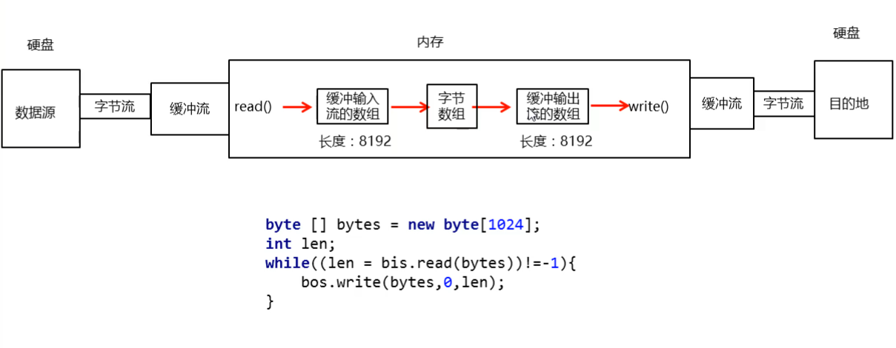

## 1.IO

### 1.1 IO 的概述【了解】

1.什么IO流(输入和输出站在内存方来说的)

​	 I表示intput,是数据从硬盘进内存的过程,称之为读

​         O表示output,是数据从内存到硬盘的过程,称之为写

​    流是一种抽象概念,数据在设备间的传输称为流,流的本质是数据传输

​	


### 1.2 IO流分类【重点】

1.IO流的体系

字符流只能操作纯文本文件

字节流什么类型的文件都可以操作


## 2.字节流

### 2.1 字节流-字节输出流快速入门【重点】

#### ==1.字节流的抽象基类==

- InputStream：这个抽象类是表示字节输入流的所有类的超类
- OutputStream：这个抽象类是表示字节输出流的所有类的超类
- 子类名特点：子类名称都是以其父类名作为子类名的后缀

2.如何读写文件？

  使用FileInputStream和FileOutputStream读写文件

3.使用字节输出流写数据的步骤


```java
package com.itheima.output;


import java.io.File;
import java.io.FileNotFoundException;
import java.io.FileOutputStream;
import java.io.IOException;

public class OutputDemo1 {
    public static void main(String[] args) throws IOException {
        //1.创建字节输出流的对象 --- 告诉虚拟机我要往哪个文件中写数据了
        FileOutputStream fos = new FileOutputStream("D:\\a.txt");
        //FileOutputStream fos = new FileOutputStream(new File("D:\\a.txt"));

        //2,写数据
        fos.write(97);

        //3,释放资源
        fos.close();


    }
}
```


### 2.2  字节流-注意事项 (了解) 


```java
public class OutputDemo2 {
    public static void main(String[] args) throws IOException {
        //1.创建字节输出流的对象
                        //注意点:如果文件不存在,会帮我们自动创建出来.
                        //       如果文件存在,会把文件清空.
        FileOutputStream fos = new FileOutputStream("C:\\itheima\\a.txt");

        //2,写数据     传递一个整数时,那么实际上写到文件中的,是这个整数在码表中对应的那个字符.
        fos.write(98);

        //3,释放资源
        fos.close(); //告诉操作系统,我现在已经不再用这个文件了.

    }
}
```

### 2.3字节流-一次写多个数据【重点】

- 写数据的方法分类

  | 方法名                                      | 说明                                       |
  | ---------------------------------------- | ---------------------------------------- |
  | void   write(int b)                      | 将指定的字节写入此文件输出流   一次写一个字节数据               |
  | void   write(byte[] b)                   | 将 b.length字节从指定的字节数组写入此文件输出流   一次写一个字节数组数据 |
  | void   write(byte[] b, int off, int len) | 将 len字节从指定的字节数组开始，从偏移量off开始写入此文件输出流   一次写一个字节数组的部分数据 |

- 示例代码

  ```java
  package com.itheima.output;

  import java.io.FileOutputStream;
  import java.io.IOException;

  public class OutputDemo4 {
    public static void main(String[] args) throws IOException {
          FileOutputStream fos = new FileOutputStream("bytestream\\a.txt");

          /*byte [] bys = {97,98,99};
          fos.write(bys);*/

          byte [] bys = {97,98,99,100,101,102,103};
        	fos.write(bys,1,2);

          fos.close();
      }
  }
  ```

### 2.4字节流写数据的两个小问题【重点】

1.字节流写数据如何实现换行

- windows:\r\n
- linux:\n
- mac:\r

```java
//System.getProperty("line.separator")
package com.itheima.output;

import java.io.FileNotFoundException;
import java.io.FileOutputStream;
import java.io.IOException;

public class OutputDemo5 {
    public static void main(String[] args) throws IOException {
        //第二个参数就是续写开关,如果没有传递,默认就是false,
        //表示不打开续写功能,那么创建对象的这行代码会清空文件.

        //如果第二个参数为true,表示打开续写功能
        //那么创建对象的这行代码不会清空文件.
        FileOutputStream fos = new FileOutputStream("bytestream\\a.txt");

        fos.write(97);
        //能加一个换行
        fos.write("\r\n".getBytes());
        fos.write(98);
        //能加一个换行
        fos.write("\r\n".getBytes());
        fos.write(99);
        //能加一个换行
        fos.write("\r\n".getBytes());
        fos.write(100);
        //能加一个换行
        fos.write("\r\n".getBytes());
        fos.write(101);
        //能加一个换行
        fos.write("\r\n".getBytes());

        fos.close();
    }
}
```

2.字节流写数据如何实现追加写入

- public FileOutputStream(String name,boolean append)
- 创建文件输出流以指定的名称写入文件。如果第二个参数为true ，则字节将写入文件的末尾而不是开头

示例代码

```java
package com.itheima.output;

import java.io.FileNotFoundException;
import java.io.FileOutputStream;
import java.io.IOException;

public class OutputDemo5 {
    public static void main(String[] args) throws IOException {
        //第二个参数就是续写开关,如果没有传递,默认就是false,
        //表示不打开续写功能,那么创建对象的这行代码会清空文件.

        //如果第二个参数为true,表示打开续写功能
        //那么创建对象的这行代码不会清空文件.
        FileOutputStream fos = new FileOutputStream("bytestream\\a.txt",true);

        fos.write(97);
        //能加一个换行
        fos.write("\r\n".getBytes());
        fos.write(98);
        //能加一个换行
        fos.write("\r\n".getBytes());
        fos.write(99);
        //能加一个换行
        fos.write("\r\n".getBytes());
        fos.write(100);
        //能加一个换行
        fos.write("\r\n".getBytes());
        fos.write(101);
        //能加一个换行
        fos.write("\r\n".getBytes());

        fos.close();
    }
}
```

### 2.5字节流写数据加异常处理【重点】

1.如何捕获异常呢？

  try-catch-finally

2.异常处理格式

```java
try{
	可能出现异常的代码;
}catch(异常类名 变量名){
	异常的处理代码;
}finally{
  //不管代码有有没有异常,百分之会执行
	执行所有清除操作;
}
```

3.为什么要使用finally

   被finally控制的语句一定会执行 不管有没有异常，也不管异常有没有被捕获，除非JVM退出

示例代码

```java
package com.itheima.output;

import java.io.FileOutputStream;
import java.io.IOException;

public class OutputDemo6 {
    public static void main(String[] args) {
        FileOutputStream fos = null;
        try {
            //System.out.println(2/0);
            fos = new FileOutputStream("D:\\a.txt");//error
            fos.write(97);
        }catch(IOException e){
           e.printStackTrace();
        }finally {
            //finally语句里面的代码,一定会被执行.
            if(fos != null){
                try {
                    fos.close();
                } catch (IOException e) {
                    e.printStackTrace();
                }
            }
        }

    }
}
```

### 2.6 字节流-写文本数据小结【重点】 


### 2.7字节流-字节输入流基本学习(一次读一个字节数据)【重点】

1.如何读文件?

   import java.io.FileInputStream类

2.构造方法

| 方法                             | 说明                                       |
| ------------------------------ | ---------------------------------------- |
| `FileInputStream(File file)`   | 通过打开与实际文件的连接来创建一个 `FileInputStream` ，该文件由文件系统中的 `File`对象  `file`命名。 |
| `FileInputStream(String name)` | 通过打开与实际文件的连接来创建一个 `FileInputStream` ，该文件由文件系统中的路径名  `name`命名 |

3.字节输入流读取文件数据的步骤

- 创建字节输入流对象
- 调用字节输入流对象的读数据方法
- 释放资源

示例代码

```java
package com.itheima.output;


import java.io.FileInputStream;
import java.io.IOException;

public class OutputDemo7 {
    public static void main(String[] args) throws IOException {
        //如果文件存在,那么就不会报错.
        //如果文件不存在,那么就直接报错.
        FileInputStream fis = new FileInputStream("bytestream\\a.txt");

        int read = fis.read();
        //一次读取一个字节,返回值就是本次读到的那个字节数据.
        //也就是字符在码表中对应的那个数字.
        //如果我们想要看到的是字符数据,那么一定要强转成char
        System.out.println((char)read);
        //释放资源
        fis.close();
    }
}
```

### 2.8 字节流读取多个字节 (重点) 

```java
package com.itheima.output;


import java.io.FileInputStream;
import java.io.IOException;

public class OutputDemo8 {
    public static void main(String[] args) throws IOException {
        FileInputStream fis = new FileInputStream("bytestream\\a.txt");
        //1,文件中多个字节我怎么办?
        /*while(true){
            int i1 = fis.read();
            System.out.println(i1);
        }*/

        int b=0;
        while ((b = fis.read())!=-1){
            System.out.println((char) b);
        }
        fis.close();
    }
}
```

### 2.9字节流复制文件【重点】

案例需求

​	把“E:\\itcast\\窗里窗外.txt”复制到模块目录下的“窗里窗外.txt”   (文件可以是任意文件)

实现步骤

- 复制文本文件，其实就把文本文件的内容从一个文件中读取出来(数据源)，然后写入到另一个文件中(目的地)

- 数据源：

  ​	E:\\itcast\\窗里窗外.txt --- 读数据 --- InputStream --- FileInputStream 

- 目的地：

  ​	myByteStream\\窗里窗外.txt --- 写数据 --- OutputStream --- FileOutputStream

代码实现

```java
package com.itheima.output;

import java.io.FileInputStream;
import java.io.FileOutputStream;
import java.io.IOException;

public class OutputDemo9 {
    public static void main(String[] args) throws IOException {
        //创建了字节输入流,准备读数据.
        FileInputStream fis = new FileInputStream("C:\\itheima\\a.avi");
        //创建了字节输出流,准备写数据.
        FileOutputStream fos = new FileOutputStream("bytestream\\a.avi");

        int b;
        while((b = fis.read())!=-1){
            fos.write(b);
        }

        fis.close();
        fos.close();
    }
}
```

## 2.10字节流-定义数组拷贝【重点】

1.如何提高文件拷贝的速度？

   一次性读写多个字节

2.方法

| 方法                                       | 说明                               |
| ---------------------------------------- | -------------------------------- |
| public int read(byte[] b) throws IOException | 从输入流读取最多`b.length`个字节的数据放入数组中    |
| public void write(byte b[], int off, int len) throws IOException | 从字节数组下标off开始，将其中len个数据写入到文件的输出流中 |

示例代码

```java
package com.itheima.output;

import java.io.FileInputStream;
import java.io.FileOutputStream;
import java.io.IOException;

public class OutputDemo10 {
    public static void main(String[] args) throws IOException {
        FileInputStream fis = new FileInputStream("C:\\1.mp4");
        FileOutputStream fos = new FileOutputStream("bytestream\\1.mp4");

        byte [] bytes = new byte[1024];
        int len;//本次读到的有效字节个数 --- 这次读了几个字节
        while((len = fis.read(bytes))!=-1){
            System.out.println(bytes);
            fos.write(bytes,0,len);
        }

        fis.close();
        fos.close();
    }
}
```

### 2.11 字节流-小数组拷贝的原理【难点】


## 3.字节缓冲流

### 3.1字节缓冲流-一次读写一个字节代码实现【重点】

1.字节缓冲流介绍

- BufferedOutputStream：字节缓冲输出流
- BufferedInputStream：   字节缓冲输入流

2.如何使用？

​	2.1 构造方法：

| 方法名                                    | 说明          |
| -------------------------------------- | ----------- |
| BufferedOutputStream(OutputStream out) | 创建字节缓冲输出流对象 |
| BufferedInputStream(InputStream in)    | 创建字节缓冲输入流对象 |

​	为什么构造方法需要的是字节流，而不是具体的文件或者路径？


   2.2 常用方法

| 方法                                       | 说明                                 |
| ---------------------------------------- | ---------------------------------- |
| public int read() throws IOException     | 从输入流中读出8192个字节到缓冲数组中，再从缓冲数组中取出一个字节 |
| public void write(int b) throws IOException | 将字节b写入到缓冲数组中，当缓冲数组满时，一次性写入目标文件     |

示例代码

```java
package com.itheima.output;


import java.io.*;

public class OutputDemo11 {
    public static void main(String[] args) throws IOException {
        //就要利用缓冲流去拷贝文件

        //创建一个字节缓冲输入流
        //在底层创建了一个默认长度为8192的字节数组。
        BufferedInputStream bis = new BufferedInputStream(new FileInputStream("bytestream\\a.avi"));
        //创建一个字节缓冲输出流
        //在底层也创建了一个默认长度为8192的字节数组。
        BufferedOutputStream bos = new BufferedOutputStream(new FileOutputStream("bytestream\\copy.avi"));

        int b;
        while((b = bis.read()) != -1){
            bos.write(b);
        }

        //方法的底层会把字节流给关闭。
        bis.close();
        bos.close();

    }
}
```

### 3.2字节缓冲流一次读写一个字节代码原理【难点 】


1.字节缓冲输入流每次读取buffer长度个字节

2.字节缓冲输出流写数据时先将缓冲字节输入流缓冲数组中的数据每次转移1个字节到自己的缓冲数组中，当缓冲数组满时，字节流一次性写出缓冲数组长度个字节

3.如果缓冲数组不满时，当调用缓冲流的close()方法时会将缓冲数组中数据写出

### 3.3字节缓冲流一次读写一个字节数组【重点 】

 1.方法

| 方法                                       | 说明                                       |
| ---------------------------------------- | ---------------------------------------- |
| public int read(byte b[]) throws IOException | 从输入流中读出8192个字节到缓冲数组中，再从缓冲数组中取出数组b.length个字节到数组b中 |
| public void write(byte b[], int off, int len) throws IOException | 将数组b中的元素，从下标0开始，向缓冲数组中写入len个字节，当缓冲数组满时，一次性写入目的地 |

2.代码实现

```java
package com.itheima.output;

import java.io.*;

public class OutputDemo12 {
    public static void main(String[] args) throws IOException {
        //缓冲流结合数组，进行文件拷贝

        //创建一个字节缓冲输入流
        BufferedInputStream bis = new BufferedInputStream(new FileInputStream("bytestream\\a.avi"));

        //创建一个字节缓冲输出流
        BufferedOutputStream bos = new BufferedOutputStream(new FileOutputStream("bytestream\\copy.avi"));

        byte [] bytes = new byte[1024];
        int len;
        while((len = bis.read(bytes)) != -1){
            bos.write(bytes,0,len);
        }

        bis.close();
        bos.close();
    }
}
```

3.原理




1.字节缓冲输入流每次读取buffer长度个字节

2.字节缓冲输出流写数据时先将缓冲字节输入流缓冲数组中的数据每次转移bytes长度个字节到自己的缓冲数组中，当缓冲数组满时，字节流一次性写出缓冲数组长度个字节

3.如果缓冲数组不满时，当调用缓冲流的close()方法时会将缓冲数组中数据写出

### 3.4 小结 【重点】


## 4.字符流

### 4.1 字节流操作出现中文乱码的问题 

```java
package com.itheima.charstream1;
import java.io.FileInputStream;
import java.io.FileNotFoundException;
import java.io.IOException;
public class CharStreamDemo1 {
    public static void main(String[] args) throws IOException {
        FileInputStream fis = new FileInputStream("charstream\\a.txt");
        int b ;
        while((b = fis.read()) != -1){
            System.out.println((char)b);
        }
        fis.close();
    }
}
```

### 4.2 字符流-编码表【了解】 

1.常见的字符集(码表)


2.常见的编码/解码方式

   ASCII编码: ASCII字符集(码表)的编码方式，1个字节，最多能表示256个字符，适用于英文

   GBK编码：GBK字符集(码表)的编码式，用1个字节表示英文，用2个字节表示中文

   UTF-8编码：Unicode字符集(码表)的编码方式，用1个字节表示英文，用3个字节表示中文

3.中文存储和展示过程


4.记忆

   windows平台默认编码方式是GBK，而ideal和工作中用的编码方式是UTF-8

### 4.3 字符串-编码和解码【重点】

1.编码方法

| 方法                                       | 说明                                       |
| :--------------------------------------- | ---------------------------------------- |
| public byte[] getBytes()                 | 使用平台的默认字符集将该`String`编码为一系列字节，将结果存储到新的字节数组中 |
| public byte[] getBytes(String charsetName） | 使用命名的字符集将这个`String`编码成一个字节序列，将结果存储到一个新的字节数组中 |

2.解码方法

| 方法                                       | 说明                                  |
| ---------------------------------------- | ----------------------------------- |
| `String(byte[] bytes)`                   | 通过使用平台的默认字符集解码指定的字节数组来构造新的 `String` |
| `String(byte[] bytes,  String charsetName)` | 构造一个新的`String`由指定用指定的字节的数组解码        |

示例代码

```java
package com.itheima.charstream1;

import java.io.UnsupportedEncodingException;
import java.util.Arrays;

public class CharStreamDemo2 {
    public static void main(String[] args) throws UnsupportedEncodingException {
        //method1();
        // String​(byte[] bytes)：
                //通过使用平台的默认字符集解码指定的字节数组来构造新的 String
       // String​(byte[] bytes, String charsetName)：
                //通过指定的字符集解码指定的字节数组来构造新的 String

        //UTF-8
        byte [] bytes1 = {-23, -69, -111, -23, -87, -84, -25, -88, -117, -27, -70, -113, -27, -111, -104};
        //gbk
        byte [] bytes2 = {-70, -38, -62, -19, -77, -52, -48, -14, -44, -79};

        //利用默认的UTF-8进行解码
        String s1 = new String(bytes1);
        System.out.println(s1);//黑马程序员

        //利用指定的GBK进行解码
        String s2 = new String(bytes2,"gbk");
        System.out.println(s2);//黑马程序员

    }

    private static void method1() throws UnsupportedEncodingException {
        // byte[] getBytes​()：
        //使用平台的默认字符集将该 String编码为一系列字节，将结果存储到新的字节数组中
        // byte[] getBytes​(String charsetName)：
        //使用指定的字符集将该 String编码为一系列字节，将结果存储到新的字节数组中

        String s = "黑马程序员";
        //利用idea默认的UTF-8将中文编码为一系列的字节
        byte[] bytes1 = s.getBytes();
        System.out.println(Arrays.toString(bytes1));

        //byte[] bytes2 = s.getBytes("UTF-8");
        byte[] bytes2 = s.getBytes("GBK");
        System.out.println(Arrays.toString(bytes2));
    }
}
```

### 4.4 字节流读取中文出现乱码的原因【了解】

​           在Ideal中默认编码是UTF-8，中文用三个字节表示，而用字节流读出中文时，如果一次只读取一个字节就强转，就造成了乱码

### 4.5 字符流-读取中文的过程 【了解】

1.字节流和字符流的使用总结

​	1.想要进行拷贝,一律使用字节流或字节缓冲流

​	2.如果是对纯文本文件的读取，使用字符流