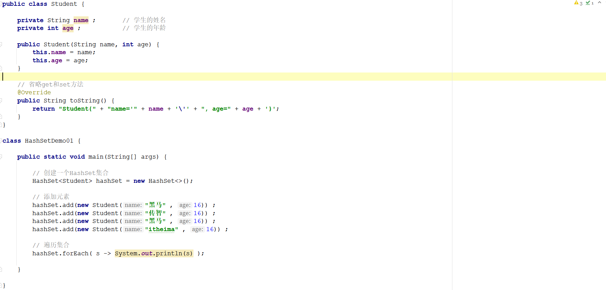
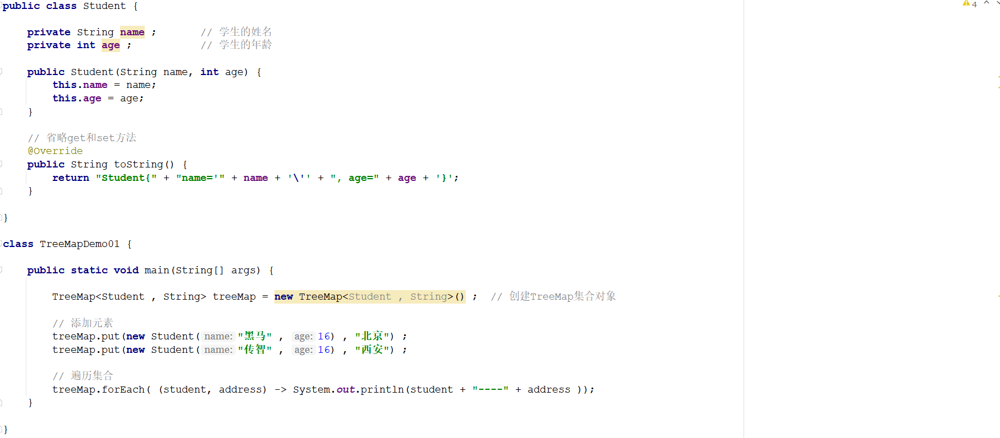
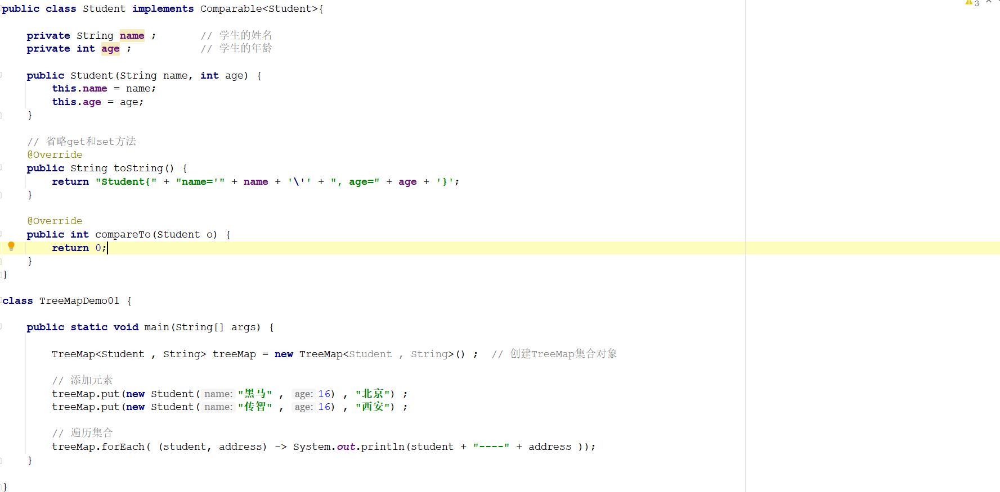

# 1 简答题

## 1.1 简答题一

请说明下述程序执行完成以后会输出几个学生的姓名和年龄并说明原因？如果只想保留一个姓名为"黑马"年龄为16的学生应该怎么处理？【业务要求：如果两个学生对象的姓名和年龄都相同则认为

是同一个对象】

|  |
| ------------------------------------------------------------ |

```java
答：
```

## 1.2 简答题二

简述HashSet集合1.7和1.8版本的底层的数据结构、以及JDK1.8引入红黑树的意义？

```java
答：
```

## 1.3 简答题三

请说明下面程序执行完毕以后在控制台的输出结果是什么？并说明原因？

|  |
| ------------------------------------------------------------ |

```java
答：
```

## 1.4 简答题四

请说明下述程序执行完毕以后在控制台会输出几个元素并且元素的内容是什么？并说明原因？如果想对学生进行先按照年龄从小到大排序，如果年龄相同则按照姓名从小到大进行排序应该怎么实

现？

|  |
| ------------------------------------------------------------ |

```java
答：
```

## 1.5 简答题五

请分析下述程序存在的问题并说明原因？

|  |
| ------------------------------------------------------------ |

```java
答：
```


# 2 编程题

### 题目1

假如你有3个室友,请使用HashSet集合保存3个室友的信息;

信息如下:

赵丽颖,18

范冰冰,20

杨幂,19

**要求:**

1:室友以对象形式存在,包含姓名和年龄两个属性;

2:使用代码保证集合中同名同年龄的对象只有一份;(相同姓名和年龄的对象认为是同一个对象)

**效果:**


**参考答案:**

```java

```


### 题目2

请使用HashMap集合保存街道两旁的店铺名称;使用门牌号作为键,店铺名作为值,然后使用**三种方式**遍历输出;

信息如下:

101,阿三面馆

102,阿四粥馆

103,阿五米馆

104,阿六快递

**要求:**

1:键是整数,值是字符串;

2:输出的信息使用"--"链接

**效果:**


**参考答案:**

```java

```

### 题目3

有2个数组，第一个数组内容为：[黑龙江省,浙江省,江西省,广东省,福建省]，第二个数组为：[哈尔滨,杭州,南昌,广州,福州]，将第一个数组元素作为key，第二个数组元素作为value存储到Map集合中。如{黑龙江省=哈尔滨, 浙江省=杭州, …}

**参考答案:**

```java

```

### 题目4

利用Map，完成下面的功能：

（1）从命令行读入一个字符串，表示一个年份，输出该年的世界杯冠军是哪支球队。如果该 年没有举办世界杯，则输出：没有举办世界杯。

（2）在原有世界杯Map 的基础上，增加如下功能： 读入一支球队的名字，输出该球队夺冠的年份列表。 例如，读入“巴西”，应当输出 1958 1962 1970 1994 2002 读入“荷兰”，应当输出 没有获得过世界杯


**参考答案:**

```java

```


### 